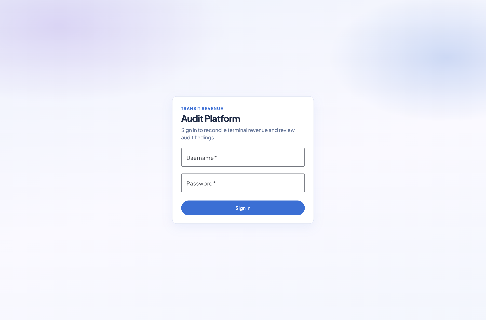
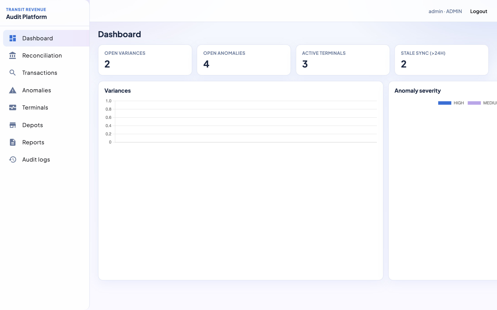
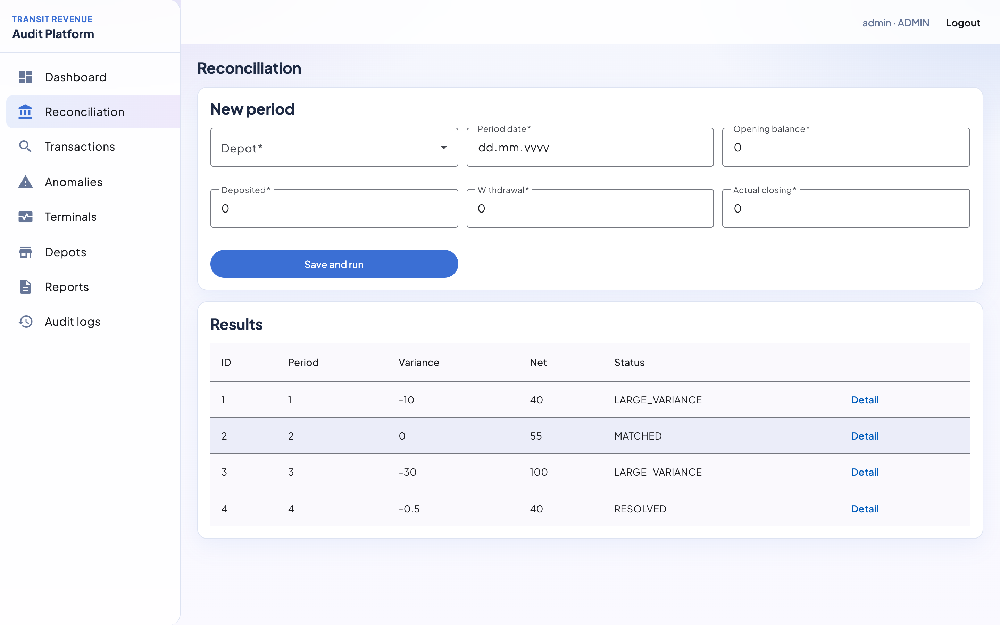
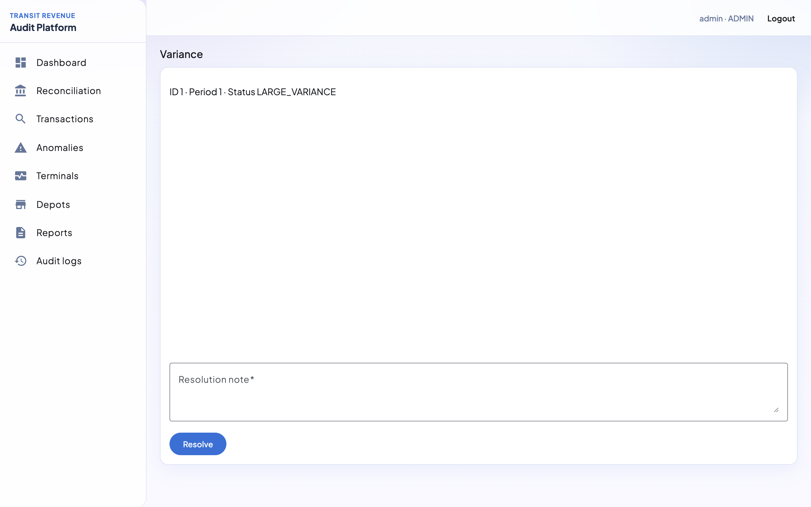
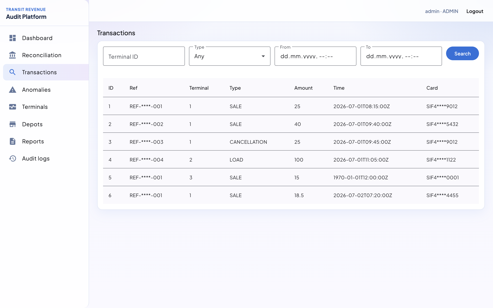
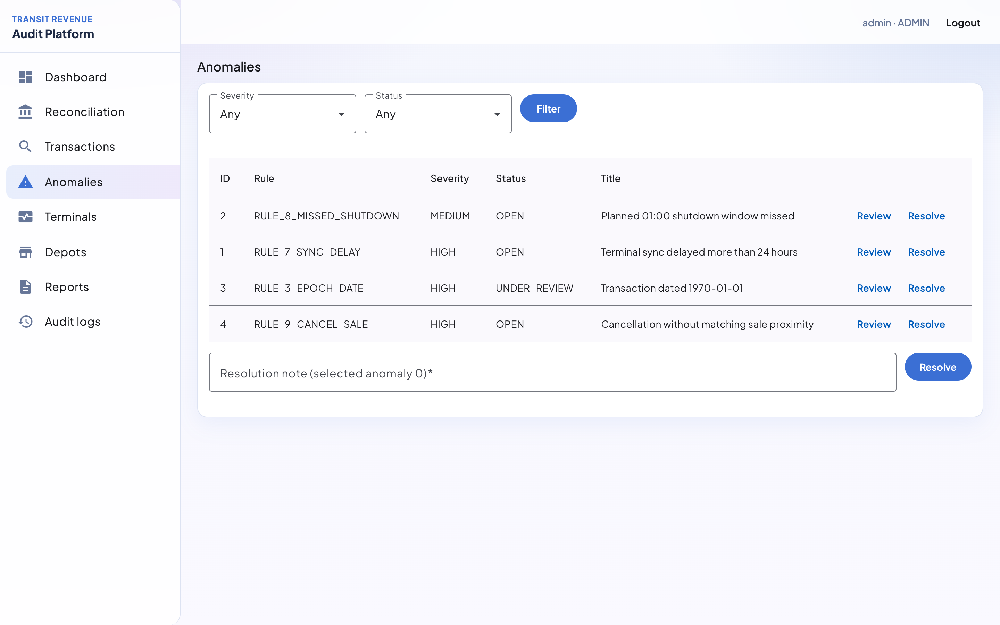
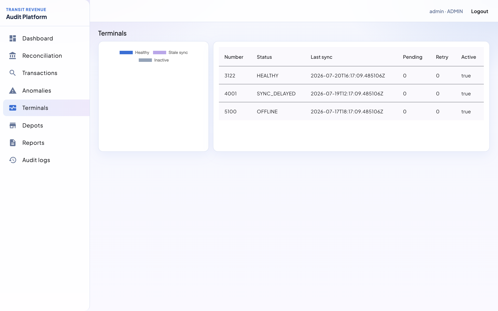
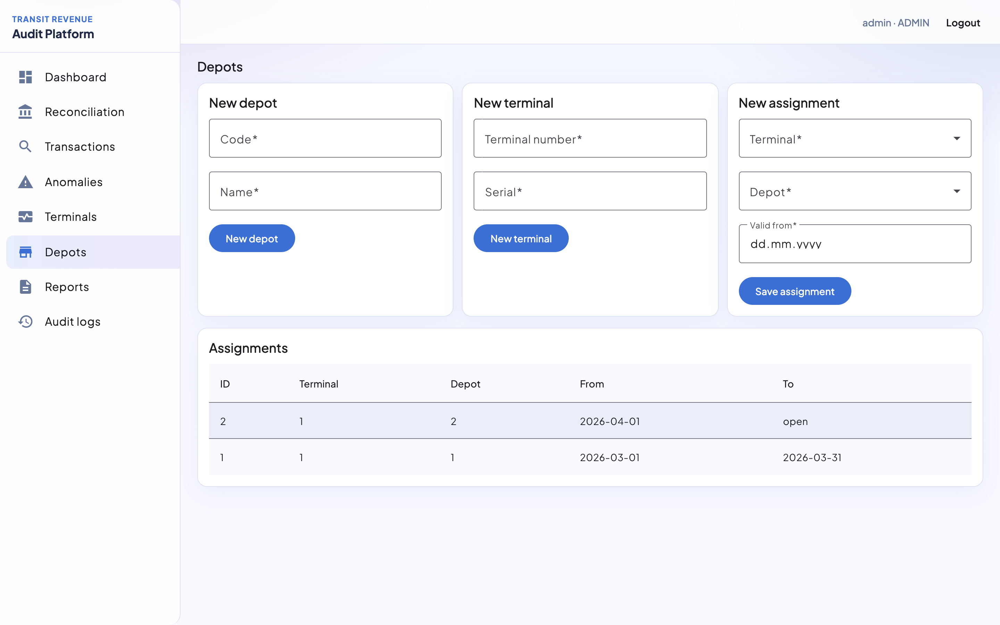
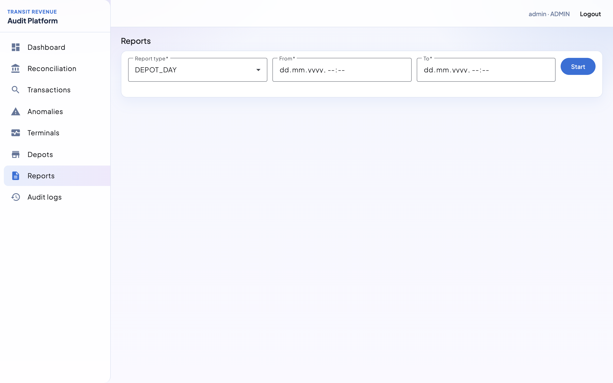
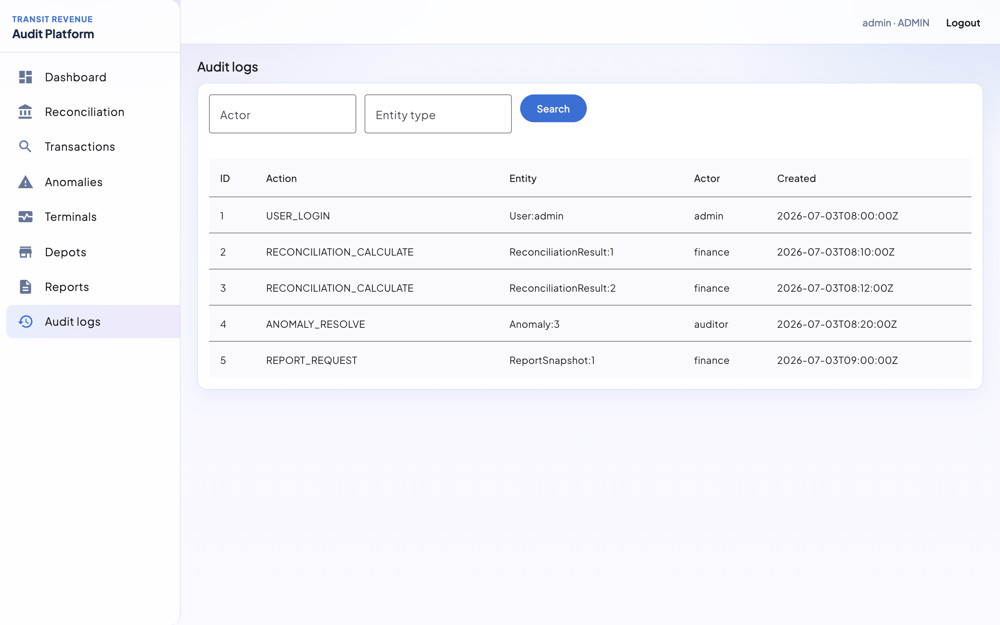

# Transit Revenue Audit Platform

A modular monolith that monitors financial transactions from public-transport terminals and PDA devices, reconciles depot cash periods, flags anomalies, and keeps an immutable audit trail.

## What it does

Transit operators collect card payments on vehicles and at stations. Those amounts must match what each **depot** records as deposited or withdrawn. This platform closes that loop:

1. **Import transactions** from terminals (CSV) — sales, cancellations, loads, refunds, and related types.
2. **Track terminal ↔ depot assignments** over time so each transaction is attributed to the depot that was valid on that date — not only the current assignment.
3. **Create financial periods** with opening balance, deposits, withdrawals, and actual closing balance.
4. **Reconcile automatically**:  
   `expectedClosing = opening + deposited − withdrawal`  
   `variance = actualClosing − expectedClosing`  
   Status becomes `MATCHED`, `SMALL_VARIANCE`, or `LARGE_VARIANCE` (threshold configurable).
5. **Detect anomalies** such as epoch-dated (1970-01-01) transactions, duplicates, missing depot coverage, stale terminal sync, missed planned shutdown, and sale/cancellation mismatches.
6. **Resolve variances**, run **report jobs**, and record sensitive actions in an **append-only audit log**.

Role-based access (`ADMIN`, `FINANCE_USER`, `AUDITOR`, `OPERATIONS_USER`) protects write paths; passwords use BCrypt and APIs use short-lived JWT tokens.

Demo seed data (users, depots, terminals, transactions, variances, anomalies, reports, audit logs) lives in [`backend/src/main/resources/db/migration/v1.0.0.sql`](backend/src/main/resources/db/migration/v1.0.0.sql).

## Screenshots

Screens from the UI with the seed data above (`admin` / `ChangeMe123!`).

| Screen | Preview |
|--------|---------|
| Login |  |
| Dashboard |  |
| Reconciliation |  |
| Variance detail |  |
| Transactions |  |
| Anomalies |  |
| Terminal health |  |
| Depot assignments |  |
| Reports |  |
| Audit logs |  |

## Stack

| Layer | Technology |
|-------|------------|
| Backend | Java 21, Spring Boot, Spring Security (JWT), JPA, Flyway, MapStruct, OpenAPI |
| Frontend | Angular, Angular Material, Signals, Chart.js |
| Database | PostgreSQL |
| Ops | Docker Compose, Nginx, GitHub Actions |

| Folder | Docs |
|--------|------|
| [`backend/`](backend/) | [`backend/README.md`](backend/README.md) |
| [`frontend/`](frontend/) | [`frontend/README.md`](frontend/README.md) |

## Quick start (local)

```bash
cp .env.example .env
docker compose up -d db

cd backend
mvn spring-boot:run

cd frontend
npm install
npm start
```

- API: http://localhost:8080  
- UI: http://localhost:4200  
- Swagger: http://localhost:8080/swagger-ui.html  
- Demo users: `admin` / `finance` / `auditor` / `ops` (password `ChangeMe123!`)

## Full stack with Docker (Nginx + API + DB)

```bash
cp .env.example .env
docker compose up --build
```

- UI (Nginx): http://localhost  
- API: http://localhost:8080  
- Swagger via Nginx: http://localhost/swagger-ui.html  

Nginx serves the Angular app and proxies `/api/` to the backend.

## Backend JAR

```bash
cd backend
mvn clean package -DskipTests
java -jar Release/transit-revenue-audit-platform.jar
```
